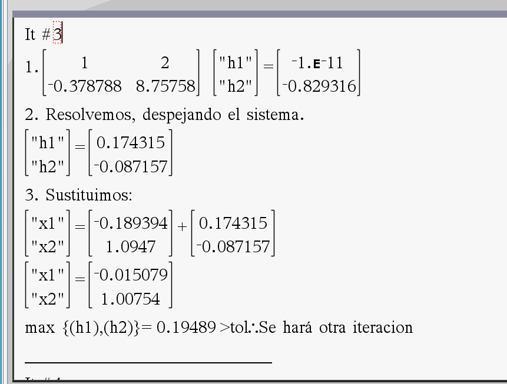
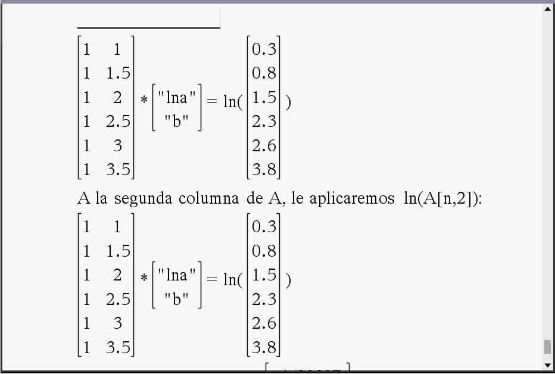
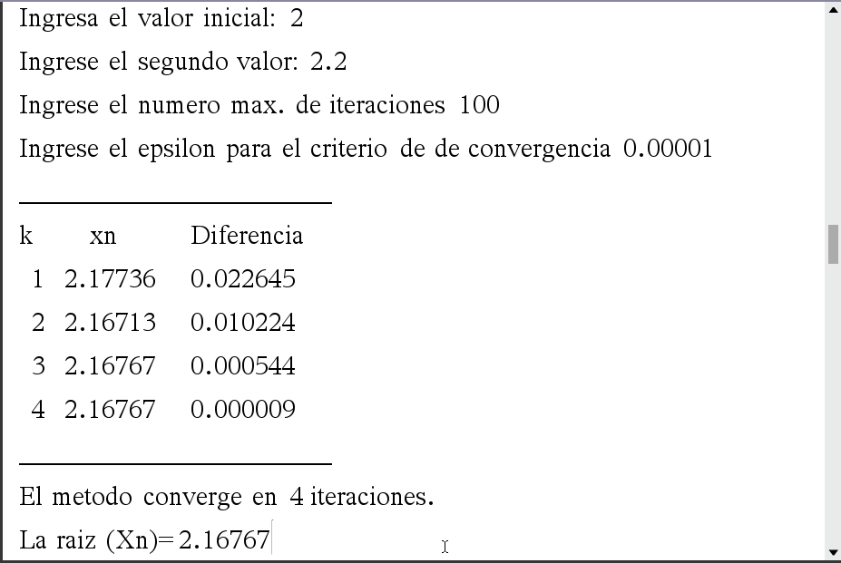
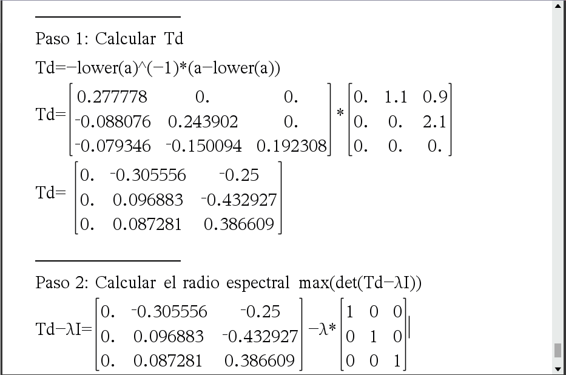

    <h1 align="center">Algorithms for TI NSPIRE CX II CAS Calculators for Numerical Calculation</h1>

    
    
    
    
    

> [!IMPORTANT]
> The codes in this repo are written in spanish.

## Developer

  

  <a href="https://github.com/ImMamey" rel="nofollow"><b>Mamey</b></a> 
  <a href="https://github.com/ImMamey/numeric-calc-ticxinspireII-code/commits?author=ImMamey" title="Commits">📖 Commits</a>

---
## Table of Contents
- [About this repository](#about-this-repository)
- [Available codes](#available-codes)
- [Requirements](#requirements)
    - [Software and extras](#software-and-extras)
- [Installation on the calculator](#installation-on-the-calculator)
- [Available algorithms by file](#available-algorithms-by-file)
- [Contributions](#contributions)
- [Support](#support)
- [License](#license)

## About this repository

This repository is a collection of automated codes written in TI-Basic for TI NSPIRE CX II CAS calculators.

The codes present here allow you to calculate some of the most important numerical calculation algorithms / numerical methods, step by step, and with iterations if applicable.

<table align="center" border="0">
<tr>
    <td align="center"> <b>System of linear equations</b></td>
    <td align="center"> <b>Potential minima</b></td>
    <td align="center"> <b>Roots by secant method</b></td>
    <td align="center"> <b>Linear equations Gauss-Seidel</b></td>
</tr>
</table>

## Available codes:
* Interpolation[^1].
* Least squares.
* Exponential minima.
* Potential minima.
* Second degree linear regression.
* Third degree linear regression.
* Jacobi iterative method for matrices.
* Convergence for Jacobi[^2].
* Gauss-Seidel iterative method for matrices.
* Square roots by the secant iterative method.
* Square roots by the bisection iterative method.
* Square roots by the Newton iterative method.
* Newton's nonlinear equation systems.

[^1]: Second and third degree.
[^2]: Spectral radius.

---

## Requirements
* [Texas Instruments NSpire CX II CAS](https://education.ti.com/en/products/calculators/graphing-calculators/ti-nspire-cx-ii-cx-ii-cas)

    

### Software and extras:
* **Calculator**: OS version 5.4.0.259 (minimum)
* **TI-Nspire CX CAS Student Software**: [Download here](https://education.ti.com/en/software/details/en/36BE84F974E940C78502AA47492887AB/ti-nspirecxcas_pc_full) (version 6.0.3.374). This desktop program allows you to test the codes on PC and transfer files.
* **File Transfer**: [File transfer webpage](https://nspireconnect.ti.com/nsc/file-transfer) (optional, in case you do not have a license to use the TI-Nspire CX CAS student software).

## Installation on the calculator

1. **Download the repository**.
2. **Locate the files**: In the `tns` folder are all the `.tns` files, these are the codes that need to be transferred to the calculator (or the student program).
3. **Transfer files**: Open the [tns file transfer webpage](https://nspireconnect.ti.com/nsc/file-transfer) and transfer all `.tns` files to the calculator.

> [!TIP]
> Preferably save the codes inside the `MyLib` folder within the calculator.

4. **Update libraries**: Within the calculator, select the following options in order: `Home Button` → `Menu Button` → `Button B` (refresh all libraries).

---

## Available algorithms by file:

<table style="width:100%">
    <tr>
       <th> Topic </th>
       <th> TNS with codes </th>
       <th> Functions</th>
    </tr>
    <tr>
        <th rowspan="3">Roots of Nonlinear Equations</th>
        <th> raice_biseccion.tns </th>
        <th> secante()  secante_pap()</th>
    </tr>
    <tr>
        <th>raices_newton.tns</th>
        <th>newton()   newton_pap() </th>
    </tr>
    <tr>
        <th>raices_secante.tns</th>
        <th>secante()   secante_pap()</th>
    </tr>
    <tr>
        <th rowspan="2"> Systems of Linear Equations: Jacobi and Gauss-Seidel</th>
        <th> jacobi.tns  </th>
        <th> jacobi(a,b,x0,tol)   jacobi_conv(a,b,x0,tol)</th>
    </tr>
    <tr>
        <th> seidel.tns </th>
        <th> seidel(a,b,x0,tol)   seidel_conv(a,b,x0,tol)</th>
    </tr>
    <tr>
        <th> Systems of Nonlinear Equations: Newton</th>
        <th>sist_ecnl_newton.tns</th>
        <th>newton_sistecnl2i()</th>
    </tr>
    <tr>
        <th>Interpolation and Curve Fitting (Least Squares)</th>
        <th>interpol_minimos.tns</th>
        <th>
        interpol(x,y,n)   minimos2(x,y,n)   minimos_expone(x,y)   minimos_poten(x,y)
        </th>
    </tr>
    <tr>
        <th>Numerical Integration</th>
        <th> integracion.tns</th>
        <th> intg_trap()   intg_longarco()   intg_trap2(a,b,tol,fx2)</th>
    </tr>
</table>

---
## Contributions

This code is not under active maintenance.

However, if you find any errors, please create an issue in the repository so it can be reviewed.

## Support

The content of this repository is **free and open-source**.

Although no active updates are being made, it remains a useful educational resource for both students and teachers. You can support by giving a ⭐ to the repository or sharing it with others.

## License
#### Summary:
1. The code in this repository is strictly educational.
2. I am not responsible for the use (or possible damages from the use) of the codes present here.
3. You are free to distribute the codes present here.

For more information, read the [`LICENSE`](resources/legal/LICENSE) file.